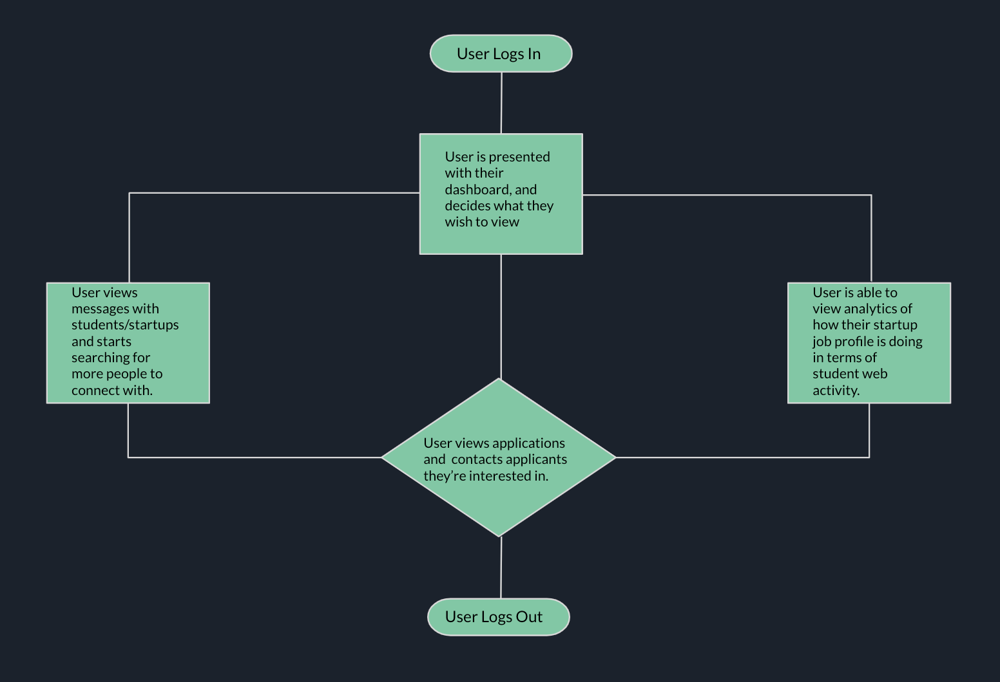
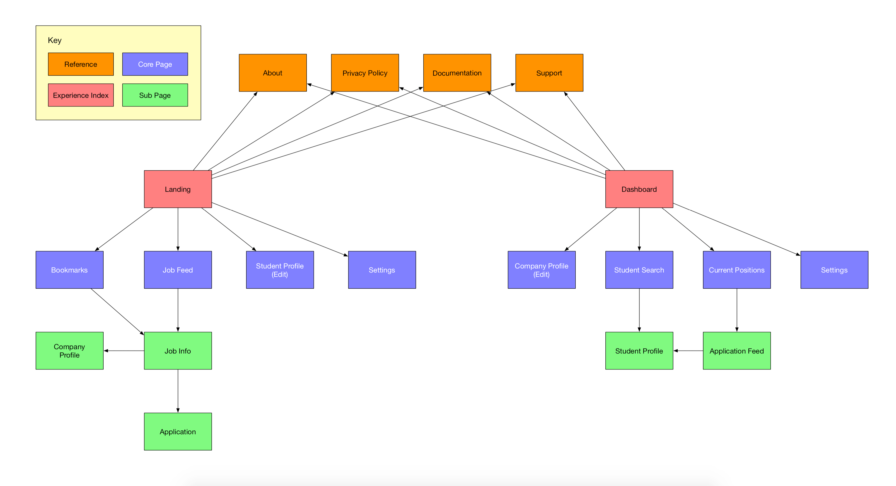
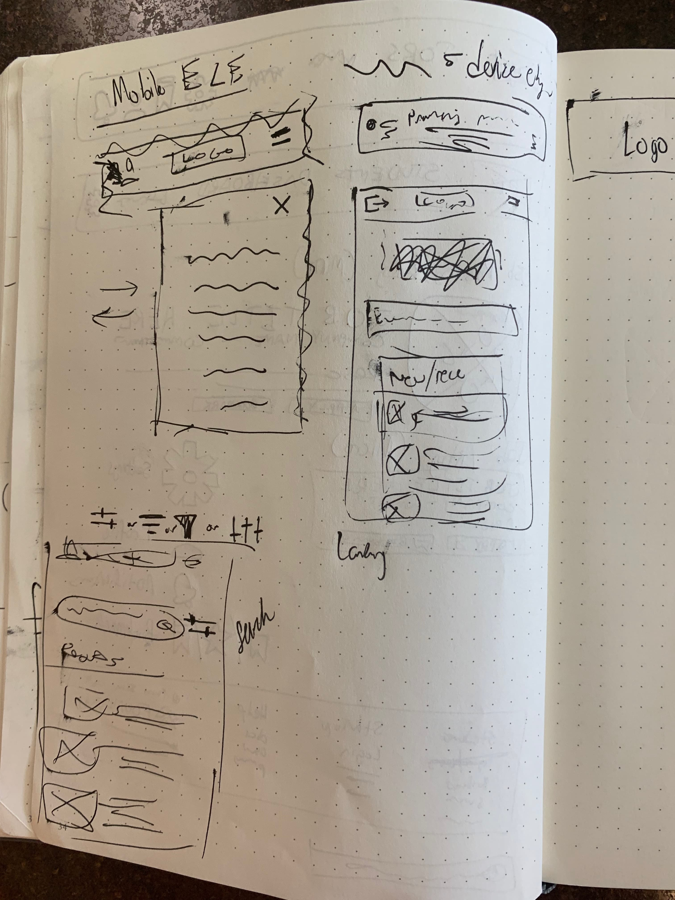
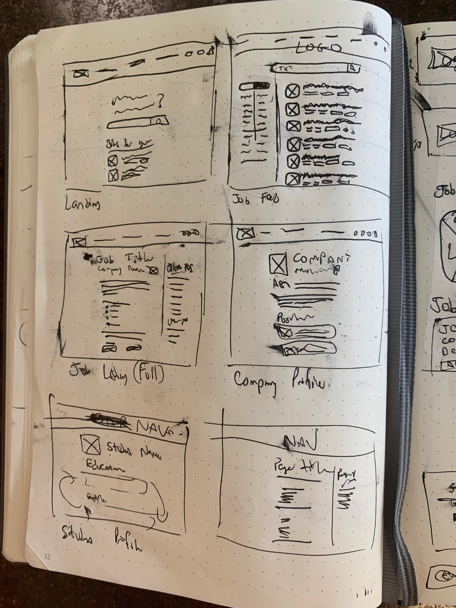
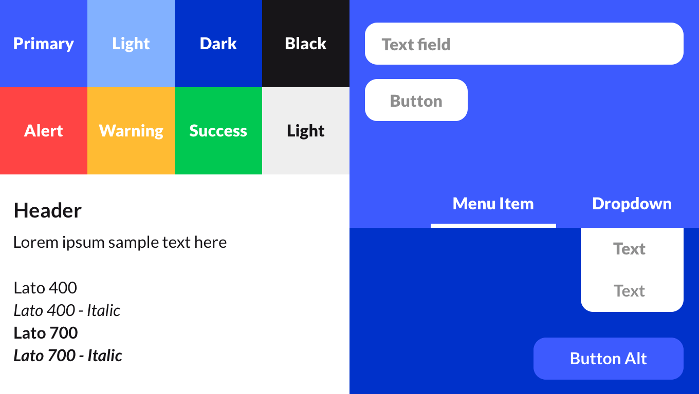

## Scoping & Design

### Users and Research

[Founders](https://foundersillinois.org/) aims to promote startup creation, funding and growth within the University of Illinois
Urbana-Champaign. At the request of many of its supported startups Founder's is making a job board for UIUC students to gain
experience working in both their field and in a startup environment. The primary function of the job board is to allow
[UIUC startups](https://entrepreneurship.illinois.edu/startups/) to post job listings and allow students of the university
to find and apply to relevant positions.

Due to these core actions being integral to the purpose of the job board, I decided that two completely separate user flows,
and therefore user experiences, with necessary within the same interface. The first one for the startups to maintain listings,
search for students and update their company's profile and the other for students to hunt for positions, go through with applying
to said positions and update their personal profiles for startup's to view. Pictured below is the user flow for the startup's
posting jobs and filtering through applications.

### Architecture

From the aforementioned user flow, in addition to a general list of required documentation pages, a list of necessary webpages
was created for the application. This list was subsequently visualized into a sitemap with paths that connect intended user flows
and likely paths of interactions. In addition to the paths each page has been placed into a category based on its purposed. The
left part of the map, beneath the reference pages, represents webpages accessible by a student or applicant, while the opposite
side is for the startups.

### Prototyping

After defining what the user experience of the web app will need to encompass, I moved forward with prototyping components of
the job board itself with paper wireframes in order to quickly compare options for layouts and interactions. Below are wireframes
of a navigation bar, card for job listings, icons, individual page layouts and their mobile equivalents.

Lastly, before making high-fidelity mockups, I developed a visual style guide for components within the application to have uniform branding.
This stylesheet can be seen below.

### Final UI Design

## Development

From this point we a chose a tech stack to start the project with. In order to integrate important features, such as dynamic content, and an extendible library
to build interfaces with, we decided upon a single-page React.JS application which would integrate with Django REST API and GCP cloud store.
